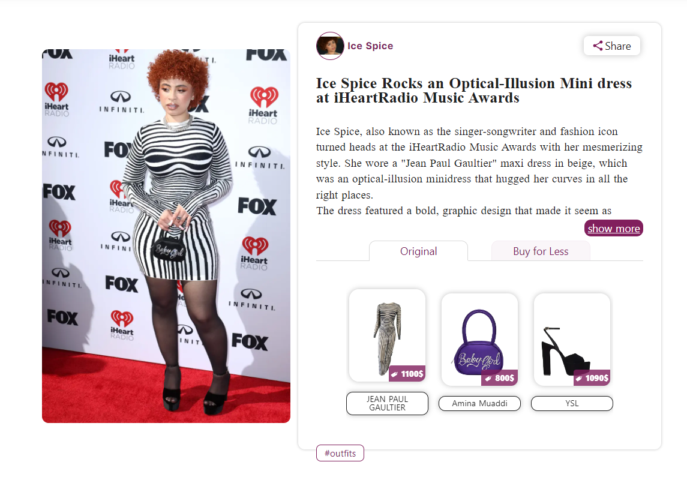

Ice Spice Kimdir? Ünlü Rapçi Hakkında Bilmeniz Gereken Her Şey!
===============================================================
Ice Spice Neden Her Yerde?
--------------------------
Geçen yaz rap sahnesinde yükselmesiyle beraber ünlü Amerikalı rapçi Ice Spice her yerde karşımıza çıkar oldu. İmza niteliği taşıyan turuncu kıvırcık saçları ve akılda kalıcı şarkılarıyla Ice Spice yılın en büyük çıkış yapan yıldızlarından.

“Rap’in Yeni Prensesi” Ice Spice Kimdir?
----------------------------------------

### Ice Spice Gerçek İsmi

PinkPantheress ile çıkardığı "Boy's a Liar Pt2" şarkısıyla ünlenen 23 yaşındaki rapçinin asıl adı Isis Gaston'dır. Bronx, New York'ta doğup büyüyen sanatçının kökenleri Nijerya ve Dominik Cumhuriyeti’ne dayanıyor.

Ailenin beş kardeşi arasından en büyüğü olan Ice Spice'ın babası bir underground rapçi fakat Spice son birkaç yıla kadar babasının müziğini dinlemediğini söylüyor.

Sahne ismi olan Ice Spice'ı daha 14 yaşındayken küçük bir Instagram hesabında kullanmak üzere bulmuş. Özellikle bu ismi seçmesinin sebebi "ice" ve "spice" kelimelerinin kafiyeli oluşundan hoşlanması ve spicy (acı) yemekleri çok sevmesidir. Elle dergisi ile verdiği bir röportajda,

"Ice Spice ismini seçtim çünkü ikisi bildiğin kafiyeliler. Bu fikri düşündüğümde 14 yaşındaydım ve o an ikinci bir Instagram hesabım için isim bulmam lazımdı. 'Ice ile ne kafiyeli? Spice.' diye düşündüm. Zaten acı yemekleri de çok seviyorum, her şeyin üstüne acı sos dökmem lazım!" sözleriyle Ice Spice isminin nereden geldiğini paylaşmıştır.

Liseye New York, Yonkers’ta giden ünlü rapçi eskiden büyük bir voleybol tutkunu oluşunu geçenlerde yayınladığı küçüklük fotoğrafıyla sosyal medyada duyurdu.

**Ice Spice Nasıl Ünlü Oldu?**
------------------------------

Drake’in ‘Munch (Feelin’ U)’ şarkısını Sirius XM Radio Station’da oynatmasıyla beraber TikTok ve Twitter gibi mecralarda popülerlik kazanan Ice Spice’ın ismi, şu an TikTok’ta 7,5 milyar görüntülenmeye sahip bir hashtag konumunda.

Ünlü rapçi bu ilgi çekici gelişmelerin ardından endüstrideki profesyonellerin dikkatini kazanarak 10K Projects ve Capitol Records şirketleri ile anlaştı.

**Lil Nas X’in Şaşırtıcı Cadılar Bayramı Kostümü**
--------------------------------------------------

2022 Cadılar Bayramında ünlü rapçi Lil Nas X kıvırcık peruk, yeşil crop ve denim şortuyla Ice Spice’ın Munch klibindeki görünüşünü kostümü haline getirdi.

**Ice Spice, Kim Kardashian & North West**
------------------------------------------

Kanye West ve Kim Kardashian’ın kızları North West’in önce TikTok hesabından Ice Spice’ın resmini çizmesiyle başlayan masum etkileşimleri, Kim Kardashian’ın kızını eğlendirmesi için Ice Spice’ı evine çağırmasıyla büyüdü. Kardashian, Spice’ı “kiralaması” hakkında sosyal medyada büyük tepkiler aldı. 23 yaşındaki bir rapçinin 9 yaşındaki bir kıza bakıcılık yapması için Kim Kardashian’ı eleştiren hayranları, sadece kızını eğlendirmek için ünlüleri eve çağırmasını problematik buluyor.

**Ice Spice’ın Dikkat Çekici Vücudu ve Tarzı**
----------------------------------------------

Boyu 167 ve kilosu 54 kg olan Ice Spice, her müzik klibinde ve katıldığı etkinlikte kıvrımları ile dikkat çeken vücudu ve özgün tarzıyla kusursuz görünüyor. Ice Spice’ın kıyafetlerine en yakın parçaları nereden bulabileceğinizi gösteren Closet Finder sitesinde **In Ha Mood klibindeki, iHeart Radio Müzik Ödülü törenindeki** ve Sabrina Carpenter ile yan yana olduğu **Sir Lucian Grainge's 2023 Artist Showcase etkinliğinde** giydiği kombinlerin detaylarına ulaşabilirsiniz.

*   [Ice Spice in Silver Bomber Jacket and Air Jordan Sneakers](https://closetfinder.com/style/ice-spice-in-silver-bomber-jacket-and-air-jordan-sneakers)
    
  * [Ice Spice Rocks an Optical-Illusion Mini dress at iHeartRadio Music Awards  (iHeart Radio)](https://closetfinder.com/style/ice-spice-rocks-an-optical-illusion-mini-dress-at-iheartradio-music-awards)
    
*   [Ice Spice in "Miu Miu" Mini School Skirt and "Prada" Bag (Sir Lucian Grainge's etkinliği)](https://closetfinder.com/style/ice-spice-in-miu-miu-mini-school-skirt-and-prada-bag)
    

Ice Spice'ın Çıkardığı Şarkılar ve Albümler
-------------------------------------------

Son iki yıldır Ice Spice’ın en önemli işlerinden olan "Princess Diana" ve "Bikini Bottom" sayesinde Spice’ın Spotify'ında şu an 37 milyonun üstünde aylık dinleyici bulunmakta. Geçen hafta Nicki Minaj’la çıkardığı “Princess Diana” remixiyle listeleri sarsan **Ice Spice’ın Nicki Minaj ile çektiği klip** hakkında bilgileri [Rising Star Ice Spice Teams Up with Nicki Minaj for Epic Remix "Princess Diana"](https://closetfinder.com/magazine/rising-star-ice-spice-teams-up-with-nicki-minaj-for-epic-remix-princess-diana) bağlantısından bulabilirsiniz.

Bunların yanı sıra Ice Spice diskografisinde bulunan diğer çalışmalar:

*   Bully Freestyle (Single)
*   No Clarity (Single)
*   Be A Lady (Single)
*   Name of Love (Single)
*   Euphoric (Single)
*   Like..? (Album)
*   Boy's a Liar Pt.2 feat. PinkPantheress (Single)
